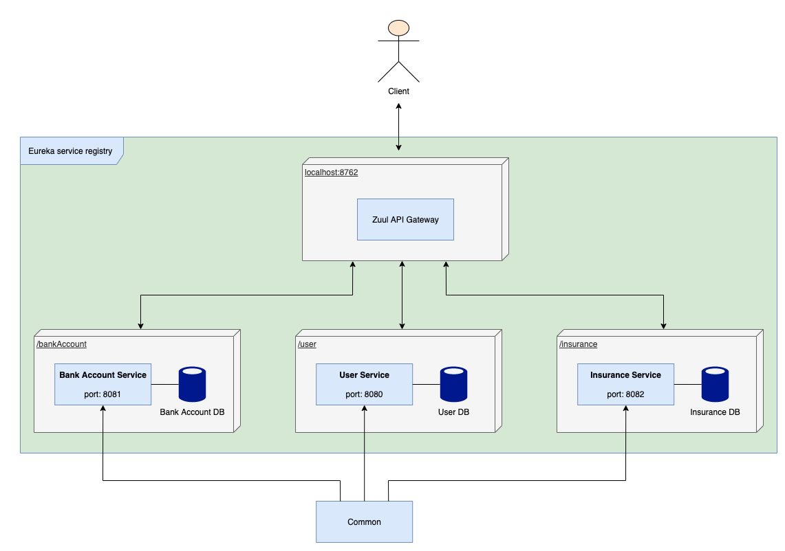

# E-banking

> :warning: **This project is not yet finish**: for e.g. Integration testing, Javadoc, exception handling

Example of simple Spring Boot microservices project using Netflix Eureka and Zuul. This project is example so no emphasis to data relevance.

There is Zull server, Eureka server and three services: User, Insurance, BankAccount.
- **User Service** manages all customers of the bank and is running on the port **8080**.
- **Insurance Service** manages all insurance that the bank provides to its customers and is running on the port **8082**.
- **BankAccount Service** manages the account of all customers and is running on the port **8081**.
- **Zuul API** is gateway (LoadBalancer) for all services. The client communicates with this Zuul API and Zuul forward the request to a specific service.
- **Eureka server** (also Discovery Server) registered all available instances of all services and Zuul server. Eureka provide information about available services to the Zuul server which needs these information for loadbalancing.

There is also a common package that contains all the common dependencies.

As database is used **H2 in-memory database** in all services, so no configuration or installation is required to run the project.

## Architecture

## Relationship between microservices

## REST API
### User - /user
| Method                                | Method Type | Body        | Response type        |
| ------------------------------------- | ----------- | ----------- | -------------------- |
| ?page=0&limit=100                     | GET         |             | Page\<UserResponse\> |
| /{id}                                 | GET         |             | UserResponse         |
|                                       | POST        | UserRequest | UserResponse         |
| /{id}                                 | DELETE      |             | void                 |
| /{userId}/insurance/{insuranceId}     | POST        |             | UserResponse         |
| /{userId}/bankAccount/{bankAccountId} | POST        |             | UserResponse         |
| /{userId}/insurance/{insuranceId}     | DELETE      |             | UserResponse         |
| /{userId}/bankAccount/{bankAccountId} | DELETE      |             | UserResponse         |
| /isInsuranceUsed/{insuranceId}        | GET         |             | boolean              |
| /isBankAccountUsed/{bankAccountId}    | GET         |             | boolean              |

### Insurance - /insurance
| Method                                      | Method Type | Body             | Response type             |
| ------------------------------------------- | ----------- | ---------------- | ------------------------- |
| ?page=0&limit=100                           | GET         |                  | Page\<InsuranceResponse\> |
| /getById/{id}                               | GET         |                  | InsuranceResponse         |
| /create                                     | POST        | InsuranceRequest | InsuranceResponse         |
| /delete/{id}                                | DELETE      |                  | void                      |
| /getByIds                                   | POST        | Set\<Long\>      | List\<InsuranceResponse\> |
  
### Bank Account - /bankAccount
| Method                                      | Method Type | Body                | Response type                |
| ------------------------------------------- | ----------- | ------------------- | ---------------------------- |
| ?page=0&limit=100                           | GET         |                     | Page\<BankAccounteResponse\> |
| /{id}                                       | GET         |                     | BankAccounteResponse         |
|                                             | POST        | BankAccounteRequest | BankAccounteResponse         |
| /{id}                                       | DELETE      |                     | void                         |
| /getByIds                                   | POST        | Set\<Long\>         | List\<BankAccounteResponse\> |

## Install manual (intellij)
- Clone code to your local repository: `git clone -b master https://github.com/farajan/e-banking.git`
- In intellij go to `File > Open`, then select e-banking file and click to `Open`
- Open `Services` tab (`View > Tool Windows > Services`) and run all Spring Boot applications

## Example of requests
http://localhost:8761/ - Eureka server

http://localhost:8762/bankAccount?page=0&limit=20 - get first 20 records of all bank accounts

http://localhost:8762/insurance?page=0&limit=20 - get first 20 records of all insurances

http://localhost:8762/user?page=0&limit=20 - get first 20 records of all users
