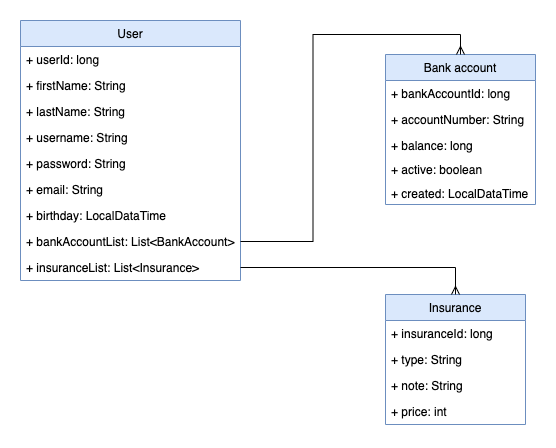

# E-banking
Example of simple Spring Boot microservices project using Netflix Eureka and Zuul.

There are three services: User, Insurance, BankAccount.
- The User Service manages all customers of the bank and is running on the port 8080.
- The Insurance Service manages all insurance that the bank provides to its customers and is running on the port 8082.
- The BankAccount Service manages the account of all customers and is running on the port 8081.

There is also a common package that contains all the common dependencies.

## Architecture

## Relationship between microservices

## REST API
### User - /user
| Method                                | Method Type | Body        | Response type        |
| ------------------------------------- | ----------- | ----------- | -------------------- |
| /getAll                               | GET         |             | Page\<UserResponse\> |
| /getById/{id}                         | GET         |             | UserResponse         |
| /create                               | POST        | UserRequest | UserResponse         |
| /delete/{id}                          | DELETE      |             | void                 |
| /{userId}/insurance/{insuranceId}     | POST        |             | UserResponse         |
| /{userId}/bankAccount/{bankAccountId} | POST        |             | UserResponse         |
| /{userId}/insurance/{insuranceId}     | DELETE      |             | UserResponse         |
| /{userId}/bankAccount/{bankAccountId} | DELETE      |             | UserResponse         |
| /isInsuranceUsed/{insuranceId}        | GET         |             | boolean              |
| /isBankAccountUsed/{bankAccountId}    | GET         |             | boolean              |

### Insurance - /insurance
| Method                                      | Method Type | Body             | Response type             |
| ------------------------------------------- | ----------- | ---------------- | ------------------------- |
| /getAll                                     | GET         |                  | Page\<InsuranceResponse\> |
| /getById/{id}                               | GET         |                  | InsuranceResponse         |
| /create                                     | POST        | InsuranceRequest | InsuranceResponse         |
| /delete/{id}                                | DELETE      |                  | void                      |
| /getByIds                                   | POST        | Set\<Long\>      | List\<InsuranceResponse\> |
  
### Bank Account - /bankAccount
| Method                                      | Method Type | Body                | Response type                |
| ------------------------------------------- | ----------- | ------------------- | ---------------------------- |
| /getAll                                     | GET         |                     | Page\<BankAccounteResponse\> |
| /getById/{id}                               | GET         |                     | BankAccounteResponse         |
| /create                                     | POST        | BankAccounteRequest | BankAccounteResponse         |
| /delete/{id}                                | DELETE      |                     | void                         |
| /getByIds                                   | POST        | Set\<Long\>         | List\<BankAccounteResponse\> |
  
  
